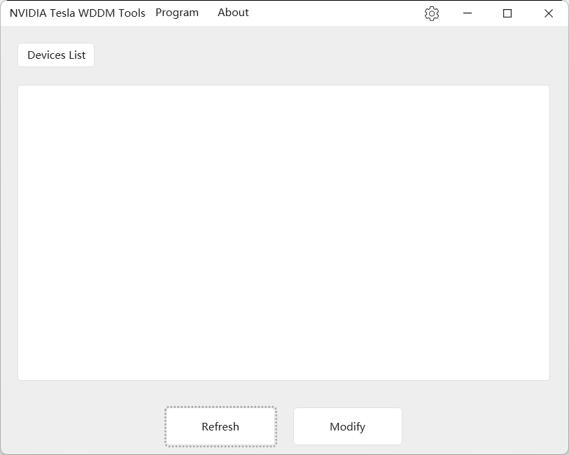

# Nvidia Tesla 计算卡工作模式切换工具

## 项目说明

本项目作为我熟悉 WPF 开源控件库 HandyControl 以及多语言适配的一个练手项目！

本项目基于我之前写的一个CLI程序

https://github.com/a645162/NvidiaTeslaCardChangeMode

目前界面为**纯英文**。

## 程序界面

## 运行要求

程序目前基于 .Net Framework 4.8。
主要是目前较新版本 Windows 10 以及 Windows 11 均预装有 .Net 4.8，因此你可以直接运行，而且 4.8 版本才支持 C#8.0 特性！

## TODO

- [ ] 适配中文！