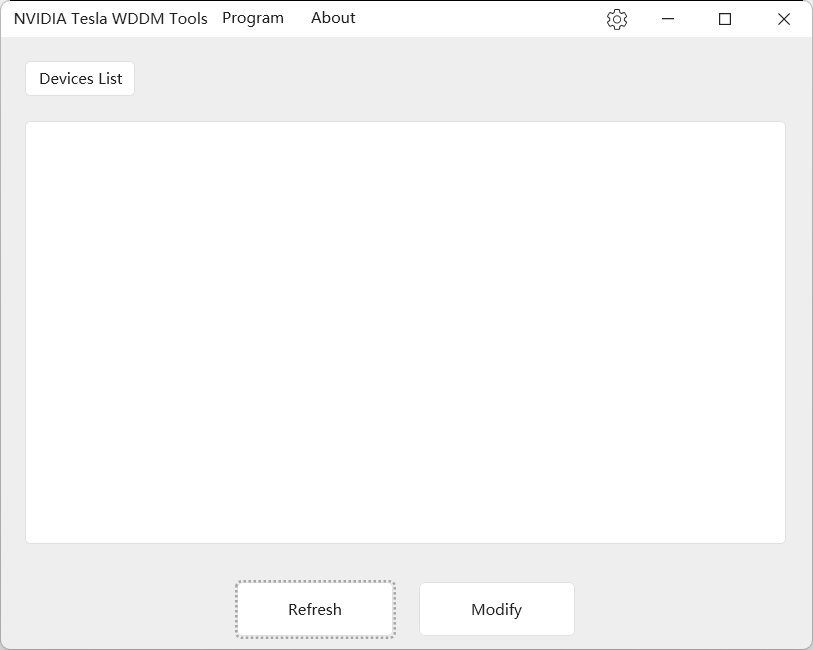

# Nvidia-Tesla-WDDM-Tools

## Project description

This project is a hands-on project for me to be familiar with HandyControl, the WPF open-source control library, and multi-language adaptation!

This project is based on a CLI program I wrote earlier

https://github.com/a645162/NvidiaTeslaCardChangeMode

The current interface is **English only**.

## Program interface

## Operational requirements

The program is currently based on the .Net Framework 4.8.
The main reason is that the newer versions of Windows 10 and Windows 11 come pre-installed with .Net 4.8, so you can run it directly, and the 4.8 version only supports C# 8.0 features!

## TODO

- [ ] Adapts to Chinese!